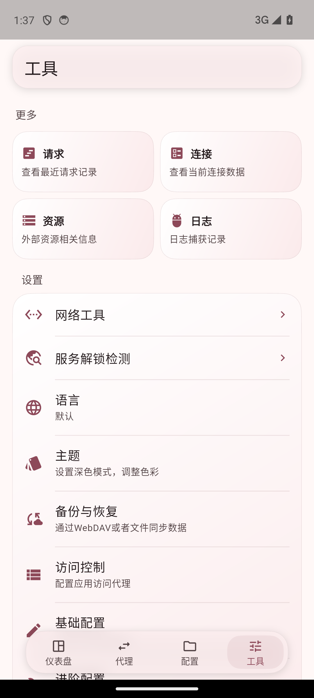
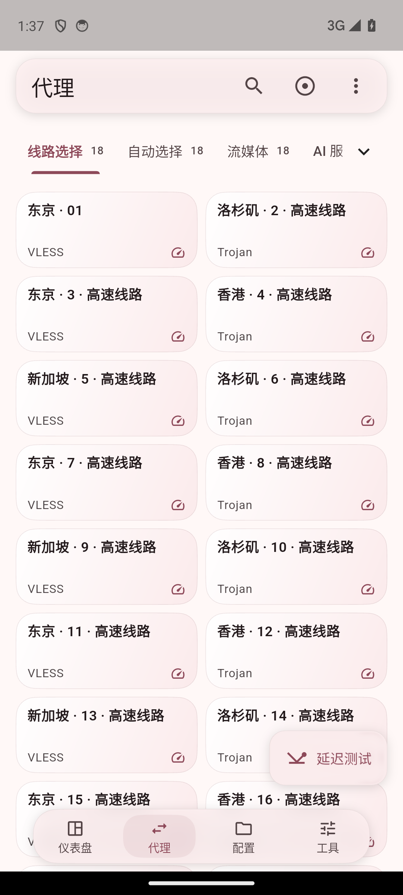

# 完成情况与验收

用户已确认本轮 UI，已完成本地实现与走查；进入正式 CI、双审查与发布流程。文档不声称流程尚未发生的合并或发布已经完成。

## 实际实现

- 底栏图标 20、文案 11.5，选中块圆角由外框减去内距；大字体时适度增高，保留原生导航语义和自定义图标。底栏采用超椭圆磨砂面，关闭与该几何不匹配的折射。
- 首页启动卡内联呈现状态／时间，速率卡补充上下行，连接摘要占整行并显示实际 TCP／UDP 数量。
- 配置页加入 URL／文件统计、来源图标／域名，保留已有订阅信息和菜单动作。
- 工具图标与标题同行、说明一行；Android UI XML 实测标准字号快捷卡从 160dp 缩为 80dp。
- 代理名称保留两行（极简档一行），元信息和延迟同行。标准字号展开档从约 106dp 缩为 78dp；网格、列表及定位滚动共享高度计算。
- 分组改为文字、淡色数量、细下划线，去掉外层大圆角框和数量徽章。列表长分组标题单行省略并提示完整名称，修复固定标题高度下的换行溢出。

## 验证证据

- flutter analyze 无问题；提交前完整 flutter test 1938 项通过，1 项可选在线更新测试跳过（退出码 0）。
- 相关既有测试与页面截图场景 45 项通过；额外 6 项覆盖三种密度、tab／列表布局、7 分组 × 每组 18 条长名称线路与 2.8 倍字体。
- 8 种页面场景含明暗、320/390/1100、中英俄日、1.4/2.8 字体，另覆盖滚动、键盘／弹层、效果关闭；出现的列表标题溢出已修复后重跑。
- 独立 Android profile UI 包 dev.flclashqa.glass_qa：无窗口 Android34，Impeller OpenGLES、host GPU。四页明暗切换、底栏拖动、连接页、服务检测面板、配置排序／菜单、分组直接切换及更多菜单选择均通过。
- QA 壳初次遗漏空状态 SVG 资源；补齐生产项目已有资源并重新构建、安装和走查后，日志无未处理异常。未改生产资源配置。
- 原有测试、依赖、核心与生成文件未改。临时本机构建 hook 设置已恢复；自有模拟器已关闭，未操作其他设备。

| 工具浅色 | 代理浅色 |
|---|---|
|  |  |

[工具深色](screenshots/dark-tools.png) · [代理深色](screenshots/dark-proxies.png)

## 边界

截图为真实生产组件搭配受控 providers；Android 密度场景采用 5 分组 × 每组 18 条模拟线路。原始本地证据位于 audits/telegram-android-20261003 的 nav-rounds、page-layout、compact-pages：PNG/XML、构建日志、测试日志、acceptance.json。

本轮未重新测量上一阶段的帧时间改善，不能把旧数字当成本轮性能结论。未验证完整签名 APK 首次启动、系统权限或真实代理连接。正式 CI 与签名发布产物由需求流程完成，并由主会话另行核验。
